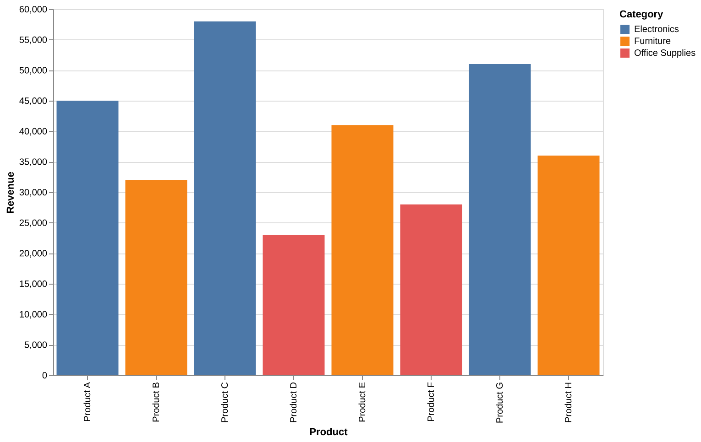
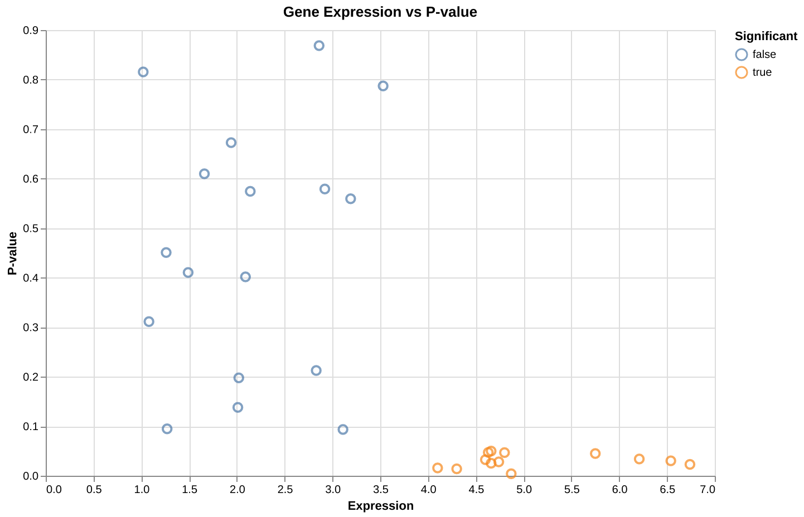
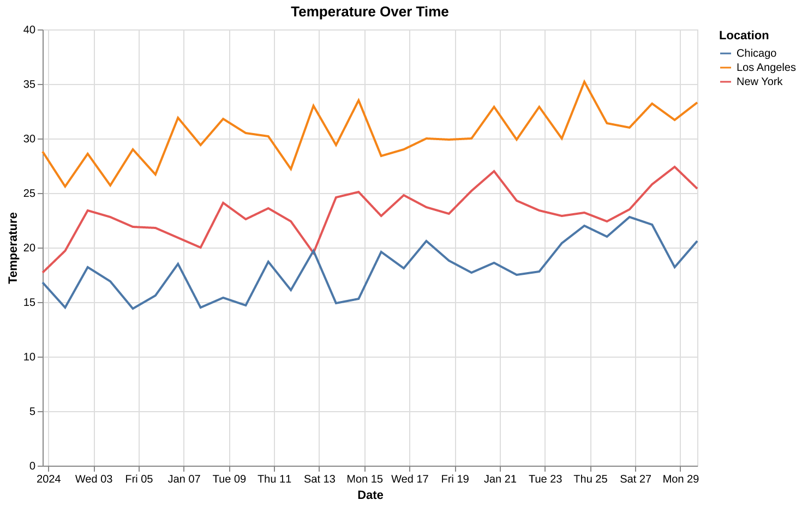
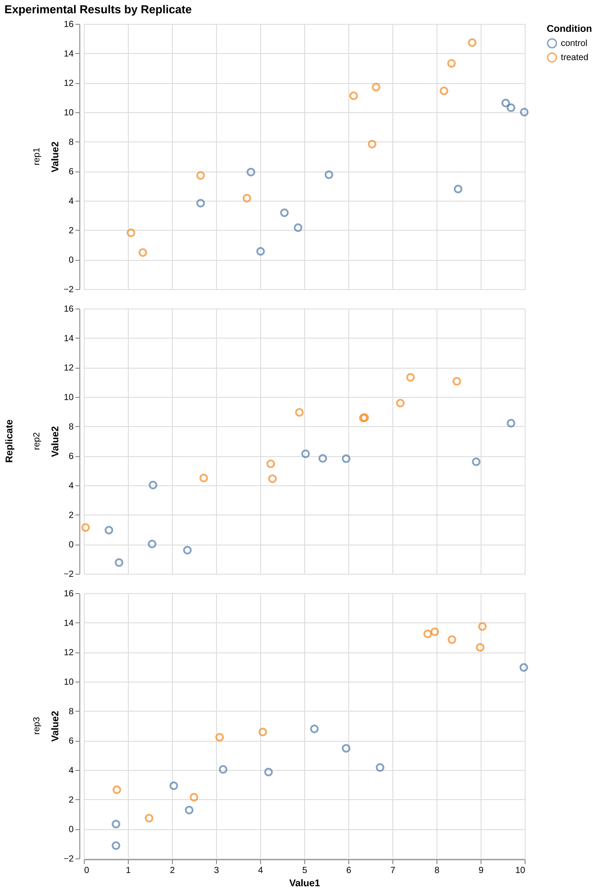
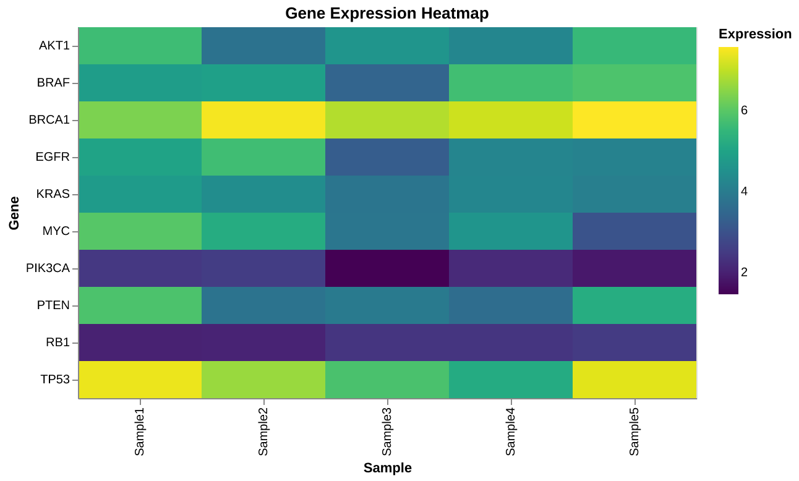

# Vizard: A DSL that Compiles High-Level Declarations to Altair & Matplotlib Code

**A stateful declarative language for LLM-driven Python visualization code combining structured keywords with natural language.**

Vizard lets you create data visualizations by describing what you want in a mix of CAPITALIZED keywords and natural language, with intelligent defaults and stateful keyword persistence for iterative figure development.

---

## Features

- 🗣️ **Natural + Structured**: Mix CAPITALIZED keywords with plain English
- 💾 **Stateful**: Keywords persist across calls, enabling iterative refinement
- 🐻‍❄️ **Polars-first**: Modern, fast dataframe operations with streaming/chaining
- 📊 **Multi-engine**: Altair (default), Matplotlib, and Seaborn support
- 🔧 **Flexible**: Supports minimal to highly detailed specifications
- 🤖 **Intelligent**: LLM fills gaps with sensible defaults
- 🔄 **Conversational**: Refine figures through natural dialogue

---

## Installation

```bash
git clone <repo-url> vizard
cd vizard
./setup.sh
```

This installs:
- `vizard` CLI tool to `~/.local/bin/vizard`
- `vizard_magic` Python package globally
- `cc_jupyter` with patches applied

**Verify installation:**
```bash
vizard version
```

**Note:** Ensure `~/.local/bin` is in your PATH:
```bash
export PATH="$HOME/.local/bin:$PATH"  # Add to ~/.bashrc or ~/.zshrc
```

---

## Quick Start - Get Coding in 2 Minutes

Choose your preferred workflow:

### Option A: Use Existing Jupyter/IPython (Fastest)

**Best for:** Quick exploration, working across multiple projects, existing Jupyter environments

**Steps:**

1. **Start IPython or Jupyter Notebook** (however you normally do)
   ```bash
   ipython
   # or
   jupyter notebook
   # or
   jupyter lab
   ```

2. **Load the vizard extension** (in a notebook cell or IPython prompt)
   ```python
   %load_ext vizard_magic
   ```

3. **Create your first visualization**
   ```python
   %%cc
   DATA sample.csv
   PLOT bar
   X category Y value
   ```

That's it! You're using Vizard.

**Example session:**
```python
# Load extension once per kernel
%load_ext vizard_magic

# Create a bar chart
%%cc
DATA sales.csv
PLOT bar
X product Y revenue

# Refine it
%%cc
WIDTH 800
COLOR category
Make the bars sorted by value descending

# Start a new figure
%%cc
RESET

# Create a scatter plot
%%cc
DATA genes.csv
PLOT scatter
X expression Y pvalue
COLOR significant
```

### Option B: Use vizard CLI (Per-Project)

**Best for:** Reproducible research, isolated environments, production work

**Steps:**

1. **Navigate to your project directory**
   ```bash
   cd ~/my-project
   ```

2. **Start vizard** (sets up environment and launches Jupyter)
   ```bash
   vizard start
   ```

   This will:
   - Copy templates (`pyproject.toml`, `CLAUDE.md`, notebook template)
   - Create isolated `.venv/` with dependencies
   - Start JupyterLab server
   - Display connection URL

3. **Open the URL** shown in your browser

4. **In a notebook cell:**
   ```python
   %load_ext vizard_magic

   %%cc
   DATA mydata.csv
   PLOT bar
   X category Y value
   ```

5. **When done:**
   ```bash
   vizard stop
   ```

---

## Examples

### Bar Chart

```python
%%cc
DATA sales.csv
PLOT bar
X product Y revenue
COLOR category
TITLE Q4 Sales Report
```



### Scatter Plot

```python
%%cc
DATA genes.csv
PLOT scatter
X expression Y pvalue
COLOR significant
Add tooltips with gene names
```



### Line Chart (Time Series)

```python
%%cc
DATA timeseries.csv
PLOT line
X date Y temperature
COLOR location
```



### Grouped Bar Chart

```python
%%cc
DATA expression.csv
PLOT bar
X gene_name Y expression_level
COLOR condition
GROUP_TYPE grouped
```


### Faceted Plot (Small Multiples)

```python
%%cc
DATA data.csv
PLOT scatter
X value1 Y value2
ROW condition
COLUMN replicate
```



### Heatmap

```python
%%cc
DATA expression_matrix.csv
PLOT heatmap
X sample Y gene
COLOR expression
Use viridis color scheme
TITLE Gene Expression Heatmap
```



### Box Plot

```python
%%cc
DATA measurements.csv
PLOT box
X group Y value
TITLE Measurement Distributions by Group
```


### Volcano Plot with Iterative Refinement

```python
%%cc
RESET

%%cc
DATA diff_expression.csv
PLOT volcano
X log2fc Y neg_log10_pvalue
IMPORT

%%cc
Add threshold lines at x=±1.5 and y=1.3

%%cc
Color upregulated red, downregulated blue, non-significant gray

%%cc
TITLE Differential Gene Expression Analysis
WIDTH 800
HEIGHT 800

%%cc
OUTPUT save
FILENAME figure1_volcano.png
```


---

## Using Vizard Specifications

### Basic Syntax

**Mix CAPITALIZED keywords with natural language:**

```python
# All keywords
%%cc DATA genes.csv PLOT bar X gene_name Y expression_level

# All natural language
%%cc Create a bar chart from genes.csv showing gene_name vs expression_level

# Mixed (recommended)
%%cc DATA genes.csv - make a bar chart with X gene_name and Y expression_level, sorted by value
```

### Essential Keywords

Keywords control behavior and **persist in state** (`.vizard_state.json`):

**Data & Plot:**
- `DATA` - Data source (file path, URL, variable name)
- `PLOT` - Chart type: `bar`, `scatter`, `line`, `histogram`, `volcano`, `heatmap`, `box`, etc.
- `X`, `Y` - Columns for axes
- `COLOR` - Column to color by
- `ROW`, `COLUMN` - Faceting (small multiples)

**Styling:**
- `WIDTH` - Chart width in pixels (default: 600)
- `HEIGHT` - Chart height in pixels (default: 400)
- `TITLE` - Chart title
- `ENGINE` - Visualization library: `altair` (default), `matplotlib`, `seaborn`

**Code Generation:**
- `FUNCTION` - Generate reusable function (default: false)
- `IMPORT` - Include imports (default: false)

**Meta Commands:**
- `KEYWORDS` or `KEYS` - Show current state
- `RESET` - Clear state and restore defaults
- `HELP` - Show help documentation

### Iterative Refinement

Keywords persist across cells - refine your figure step by step:

```python
# Start with basic plot
%%cc
DATA mydata.csv
PLOT bar
X category Y value

# Add color (other keywords persist)
%%cc
COLOR group

# Adjust size
%%cc
WIDTH 800
HEIGHT 500

# Add natural language styling
%%cc
Make the bars green and add value labels on top

# Check what's in state
%%cc
KEYWORDS

# Start fresh for new figure
%%cc
RESET
```

### State Management

Vizard maintains state in `.vizard_state.json`:

```python
%%cc WIDTH 700 HEIGHT 450 DATA mydata.csv

%%cc PLOT bar X category Y value
# ↑ Automatically uses WIDTH: 700, HEIGHT: 450 from previous cell

%%cc KEYWORDS
# Shows all current keyword values

%%cc RESET
# Clears state, restores defaults
```

**Workflow:**
1. Iterate on a figure → State accumulates
2. Figure complete → Use it
3. Start new figure → `RESET` → Fresh state

### Code Generation Options

```python
# Default: No imports, script-style code
%%cc
DATA data.csv
PLOT bar
X category Y value

# With imports (for copy-paste to .py files)
%%cc
DATA data.csv
PLOT bar
X category Y value
IMPORT

# Generate reusable function
%%cc
DATA data.csv
PLOT bar
X category Y value
FUNCTION
IMPORT
```

### Natural Language + Keywords

```python
# Natural language for details
%%cc
DATA genes.csv
Create a volcano plot showing log2fc vs pvalue
Color upregulated genes red and downregulated blue
Add threshold lines at x=±1.5 and y=1.3

# Keywords for structure
%%cc
DATA genes.csv
PLOT volcano
X log2fc
Y pvalue
THRESHOLD_FC 1.5
THRESHOLD_P 1.3

# Mix both (recommended)
%%cc
DATA genes.csv PLOT volcano X log2fc Y pvalue
Color significant genes red, add threshold lines at 1.5 and 1.3
```

### Dynamic Keywords

Any CAPITALIZED word becomes a keyword and persists in state:

```python
%%cc
DATA results.csv
PLOT scatter
X log2fc Y pvalue
THRESHOLD 0.05
Highlight points where pvalue < THRESHOLD in red

%%cc
THRESHOLD 0.01
# Now uses new threshold value

%%cc KEYWORDS
# Shows: THRESHOLD: 0.01
```

---

## Vizard CLI Commands

The `vizard` command manages project environments and JupyterLab:

```bash
vizard start [options]     # Start JupyterLab server
  -p, --port PORT          # Custom port (default: 9999)
  -t, --token TOKEN        # Custom token (default: auto-generated)
  --host HOST              # Custom hostname (default: system hostname)
  -f, --foreground         # Run in foreground

vizard stop [options]      # Stop JupyterLab server
  -p, --port PORT          # Stop server on specific port

vizard status              # Show server status

vizard clean [options]     # Remove runtime files
  --purge                  # Remove all vizard files including .venv

vizard update              # Update CLAUDE.md and vizard executable

vizard version             # Show version
vizard help                # Show help
```

**Examples:**

```bash
# Start with custom port for remote server
vizard start --port 8888 --host myserver.example.com

# Check status
vizard status

# Clean up runtime files (keeps notebooks and .venv)
vizard clean

# Full cleanup (removes everything except notebooks)
vizard clean --purge

# Stop server
vizard stop
```

---

## Advanced Features

### Polars Data Manipulation

Vizard generates Polars streaming/chaining code when data prep is needed:

```python
%%cc
DATA results.csv
Filter to rows where pvalue < 0.05
Create a volcano plot showing log2fc vs pvalue
Color significant genes red

# Generated code uses Polars chaining:
# df = (pl.read_csv('results.csv')
#     .filter(pl.col('pvalue') < 0.05)
#     .with_columns([...]))
```

### Spelling Tolerance

Common typos are recognized:

```python
%%cc
DATA data.csv
PLOT bar
X cat Y val
COLOUR blue
TITEL My Chart
HIGHT 450
# Works! Recognizes COLOUR→COLOR, TITEL→TITLE, HIGHT→HEIGHT
```

### Multi-Engine Support

```python
# Altair (default) - declarative, interactive
%%cc
ENGINE altair
DATA data.csv
PLOT scatter
X value1 Y value2

# Matplotlib - publication-quality
%%cc
ENGINE matplotlib
DATA data.csv
PLOT bar
X category Y value

# Seaborn - statistical plots
%%cc
ENGINE seaborn
DATA data.csv
PLOT box
X group Y measurement
```

---

## Default Values

```
ENGINE: altair
DF: polars
WIDTH: 600
HEIGHT: 400
FUNCTION: false
IMPORT: false
OUTPUT: display
```

Other keywords (X, Y, COLOR, etc.) have no defaults—they only appear in state when specified.

---

## Supported Plot Types

- ✅ **Bar charts** - Simple, stacked, grouped
- ✅ **Scatter plots** - With size, color, shape encodings
- ✅ **Line charts** - Time series, multi-series
- ✅ **Histograms** - Configurable bins
- ✅ **Volcano plots** - Bioinformatics differential expression
- ✅ **Heatmaps** - Matrix visualizations
- ✅ **Box plots** - Distribution comparisons
- ✅ **Faceted plots** - Small multiples (row/column)

Coming soon: Violin plots, ridgeline plots, chord diagrams

---

## Workflow Tips

1. **Start simple**: Begin with minimal specification, iterate
2. **Use KEYWORDS often**: Check state to understand what's persisted
3. **RESET between figures**: Clear state when starting new visualization
4. **Mix styles**: Keywords for structure, natural language for styling
5. **Leverage state**: Set common parameters (WIDTH, HEIGHT) once, use many times
6. **Generate functions**: Use FUNCTION for reusable plotting code

---

## Troubleshooting

**Q: `%load_ext vizard_magic` gives "No module named 'vizard_magic'"**
- Run `./setup.sh` again to ensure vizard_magic is installed
- Check: `python3 -c "import vizard_magic"` should work

**Q: My plot isn't using the right dimensions**
- Check state with `%%cc KEYWORDS` - are WIDTH/HEIGHT set?
- Use `%%cc RESET` to clear old dimensions

**Q: Code has imports but I don't want them**
- IMPORT defaults to false - don't include IMPORT keyword
- Check if IMPORT is in state: `%%cc KEYWORDS`

**Q: Keywords not persisting**
- Ensure keywords are CAPITALIZED
- Check `.vizard_state.json` exists in directory

**Q: Permission denied: '/root/code'**
- This is fixed by patches applied during `setup.sh` or `vizard start`
- If you see this error, re-run `setup.sh` or check patch output

**Q: Different Python versions causing issues**
- Global mode (setup.sh) installs for the Python version `python3` points to
- Per-project mode (vizard start) uses the .venv's Python version
- If using multiple Python versions, use Per-Project mode for each project

---

## Technical

### Installation Modes

Vizard supports two installation modes:

**Mode 1: Global Installation (Quick & Convenient)**

`setup.sh` installs `cc_jupyter` and `vizard_magic` to `~/.local/lib/python*/site-packages/` and applies patches globally. Works in any Jupyter/IPython environment.

- ✅ Quick data exploration across projects
- ✅ Existing Jupyter workflows
- ⚠️ Single cc_jupyter version across all projects

**Mode 2: Per-Project Isolated (Reproducible & Safe)**

`vizard start` creates project-local `.venv/` with cc_jupyter installed and patched in the project's virtual environment. Each project has its own dependency versions.

- ✅ Published research / production
- ✅ Reproducible environments with version-pinned dependencies
- ⚠️ Requires `vizard start` per project

**Note:** Both modes can coexist. Use Global for daily work, Per-Project for important analyses.

### Version Management

`setup.sh` installs a **pinned version** of `cc_jupyter` (0.0.1) tested with Vizard's patches.

If you see a version mismatch warning during setup:
```bash
⚠ Version mismatch detected
Patches are tested with version 0.0.1
```

Force reinstall the vendored version:
```bash
pip install --user --force-reinstall ~/.local/share/vizard/lib/vendor/claude_code_jupyter_staging-0.0.1-py3-none-any.whl
~/.local/share/vizard/lib/patch_global_cc_jupyter.sh
```

### Patching Mechanism

Vizard modifies `cc_jupyter` to enable the `%%cc` magic command for Vizard specifications:

**Global Patching:**
- `lib/patch_global_cc_jupyter.sh` - Patches globally installed cc_jupyter
- Applied once during `setup.sh`
- Affects all projects using global installation

**Per-Project Patching:**
- `lib/patch_jupyter_magic.sh` - Patches project-local cc_jupyter
- Applied during `vizard start` for each project
- Isolated to project's `.venv/`

**What gets patched:**
- Registers the `vizard_magic` IPython extension
- Enables `%%cc` cell magic in Jupyter notebooks
- Loads the Vizard specification (`CLAUDE.md`) into Claude Code's context

### Repository Structure

```
vizard/
├── vizard                         # Main executable (bash script)
├── setup.sh                       # Installation script
├── uninstall.sh                   # Uninstallation script
├── README.md                      # This file
├── lib/
│   ├── vizard_magic/
│   │   └── __init__.py            # Jupyter IPython extension
│   ├── patch_jupyter_magic.sh    # Per-project cc_jupyter patcher
│   ├── patch_global_cc_jupyter.sh # Global cc_jupyter patcher
│   └── vendor/
│       └── claude_code_jupyter_staging-0.0.1-py3-none-any.whl
├── templates/
│   ├── CLAUDE.md                  # Vizard specification (~30KB)
│   ├── pyproject.toml             # Project dependencies template
│   ├── vizard_template.ipynb      # Notebook template
│   └── purge_manifest.txt         # Cleanup manifest
└── test/
    ├── data/                      # Synthetic test datasets
    ├── generate_sample_data.py    # Test data generator
    ├── generate_images.ipynb      # Image generation notebook
    └── vizard_tests1.ipynb        # Test suite
```

**Per-Project Files (created by `vizard start`):**
```
<your-project>/
├── .env.jupyter              # Jupyter configuration
├── .jupyter.pid              # Process ID
├── .jupyter.log              # Server logs
├── pyproject.toml            # Python dependencies
├── uv.lock                   # Dependency lock file
├── .venv/                    # Virtual environment
├── CLAUDE.md                 # Vizard specification
├── .vizard_state.json        # Keyword state
├── .vizard_template.ipynb    # Notebook template
└── .claude/
    └── settings.json         # Claude Code permissions
```

---

## Design Philosophy

### Vizard is NOT:
- ❌ A rigid DSL with one-to-one code mapping
- ❌ A replacement for learning Altair/Matplotlib/Seaborn
- ❌ Guaranteed to produce identical code each time

### Vizard IS:
- ✅ Structured guidance via keywords
- ✅ LLM reasoning for intelligent defaults
- ✅ Balance of consistency and flexibility
- ✅ Iterative figure development workflow
- ✅ Natural language + structure hybrid

---

## Testing

Run the comprehensive test suite:

```bash
cd vizard/test
jupyter notebook vizard_tests1.ipynb
```

**Test coverage (35+ tests):**
- Syntax variations
- Meta commands (KEYWORDS, RESET, HELP)
- Code generation (FUNCTION, IMPORT)
- Plot types
- Grouping & faceting
- Conversational refinement
- State persistence
- Dynamic keywords
- Spelling tolerance

---

## Future Roadmap

**Phase 2: Refinement** (based on testing feedback)
- Gallery fetching for uncommon plot types
- Additional plot type examples
- Enhanced dynamic keywords

**Phase 3: Expansion**
- Additional plot types for all engines
- Multi-panel layout improvements
- Interactive features (brush, zoom, tooltips)

**Phase 4: Publication Mode**
- DPI control
- Panel labels (A, B, C)
- Journal-specific formats
- Fine-grained typography

---

## Contributing

This is an early prototype. Feedback welcome on:
- Keyword design
- Default values
- Natural language parsing
- Code quality
- Missing features

---

## License

To be determined.

---

## Acknowledgments

Built with:
- [Claude](https://claude.ai) (Anthropic) - LLM interpreter
- [Altair](https://altair-viz.github.io/) - Declarative visualization
- [Matplotlib](https://matplotlib.org/) - Comprehensive visualization
- [Seaborn](https://seaborn.pydata.org/) - Statistical data visualization
- [Polars](https://pola.rs/) - Fast dataframes
- [Claude Code](https://github.com/anthropics/claude-code) - CLI tool

---

**Quick Reference Card:**

```python
# Essential commands
%load_ext vizard_magic    # Load extension (once per kernel)
%%cc KEYWORDS              # Show current state
%%cc RESET                 # Clear state and start fresh
%%cc HELP                  # Show help

# Basic syntax
%%cc DATA file.csv PLOT bar X col1 Y col2

# Natural + keywords
%%cc DATA file.csv - create a scatter plot with X val1 and Y val2 colored by group

# Iterate on a figure
%%cc WIDTH 800 COLOR category TITLE My Chart

# Generate code with imports
%%cc IMPORT
```

Ready to create beautiful visualizations? **Start with Option A above - it takes 30 seconds!**
